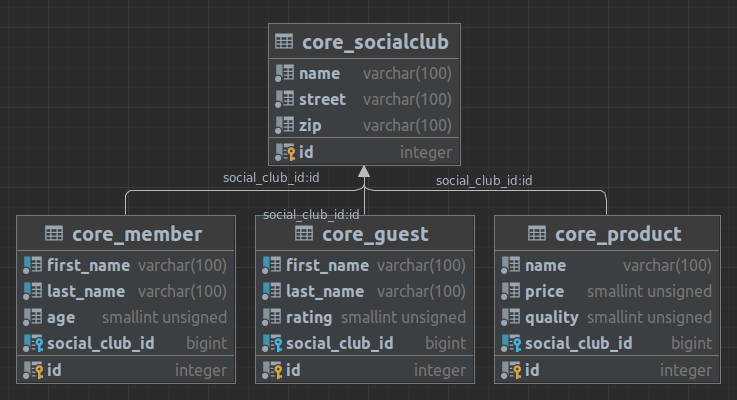

# Introduction to GraphQL and Strawberry

## Workshop Outline
- _TypeDefs_
- _Query_
- _Mutation_
- _GraphQL Schema Language_

#### System Requirements
- [git](https://git-scm.com/) v2 or greater
- [python3.11](https://www.python.org/downloads/) or greater + pip (maybe a lower version will work too - please try it yourself)

----
This is the minimum workshop setup. Please prepare the project as described below.

#### Pre-Workshop Instructions/Requirements (install)
- `git clone https://github.com/Speedy1991/strawberry-workshop.git`
- `cd strawberry-workshop`
- If you want to use a virtual environment click [here](https://virtualenv.pypa.io/en/latest/user_guide.html) for instructions 
- `pip install -r requirements.txt`
- `python manage.py migrate`
- `python manage.py loaddata assets/data.json` (_Installed 206 object(s) from 1 fixture(s)_)
- `python manage.py runserver`

#### Frontend
- `cd frontend`
- `yarn`
- `yarn dev`

#### Test your setup
- Open your browser and visit `http://127.0.0.1:8000/admin/` and try to login with `root:toor`
- The GraphiQL endpoint is at `http://127.0.0.1:8000/graphql/`

----

## Exercise overview

You will have about 10 min per exercise. Do not forget to reload your graphiql endpoint after you changed the schema to refelect the changes

- [Exercise 1](https://github.com/Speedy1991/strawberry-workshop/tree/main/exercise1): Write your first TypeDefs and resolvers
- [Exercise 2](https://github.com/Speedy1991/strawberry-workshop/tree/main/exercise2): Extend your TypeDefs with more complex resolvers
- [Exercise 3](https://github.com/Speedy1991/strawberry-workshop/tree/main/exercise3): Refactor
- [Exercise 4](https://github.com/Speedy1991/strawberry-workshop/tree/main/exercise4): Write a mutation; Add Field Arguments
- [Exercise 5](https://github.com/Speedy1991/strawberry-workshop/tree/main/exercise5): Interfaces
- [Exercise 6](https://github.com/Speedy1991/strawberry-workshop/tree/main/exercise6): Dataloaders
- [Exercise 7](https://github.com/Speedy1991/strawberry-workshop/tree/main/exercise7): Subscriptions
- Let's talk about ASGI/Starlette and so on
- Homework: Check out [strawberry-django](https://github.com/strawberry-graphql/strawberry-django)

## Working through it
This is a very exercise-heavy workshop. You'll find the exercises in the _strawberry_workshop/exercise[number]_ directory.
Don't forget to change the used schema in the [urls.py](https://github.com/Speedy1991/strawberry-workshop/blob/main/core/urls.py#L4).

You find some helpful content on the Docs:
- [strawberry](https://strawberry.rocks/docs)
- [django queries](https://docs.djangoproject.com/en/5.0/topics/db/queries/)

## Helpful shortcuts
- _TODO:_ This is **your** job
- _DOCS:_ This will give you a link to the specific doc page
- _DJANGO:_ This will help you with some django specific code
- _HINT:_ This will give you some useful tips
- _QUESTION:_ Try to answer the question yourself - if you don't find the answer, feel free to ask :)

## Django Cheatsheet
- `SELECT * FROM <table>` -> `<ModelName>.objects.all()`
- `SELECT * FROM <table> WHERE id=<id>` -> `<ModelName>.objects.get(id=id)` (raises if not exist)

## Database overview

## Strawberry
__Docs:__ https://strawberry.rocks/

__Discord:__ https://strawberry.rocks/discord (be friendly, this is an awesome community)

__Github:__ https://github.com/strawberry-graphql/strawberry

__Creator:__ [Patrick](https://github.com/patrick91) Thank you so much for creating this awesome framework

__Core Devs:__ [bellini666](https://github.com/bellini666), [DoctorJohn](https://github.com/DoctorJohn), [erikwrede](https://github.com/erikwrede), [skilkis](https://github.com/skilkis) 

In this context, we should generally express our gratitude to all open-source developers and contributors.

## License
This material is available for private, non-commercial use under the [GPL version 3](https://www.gnu.org/licenses/gpl-3.0-standalone.html).

If you would like to use this material to conduct your own workshop, please contact me at arthur.holz.91@gmail.com

## Closing

If you enjoyed the workshop, [Patrick](https://github.com/patrick91) would surely appreciate a small [sponsorship](https://github.com/sponsors/patrick91) to support his open-source work going forward.
